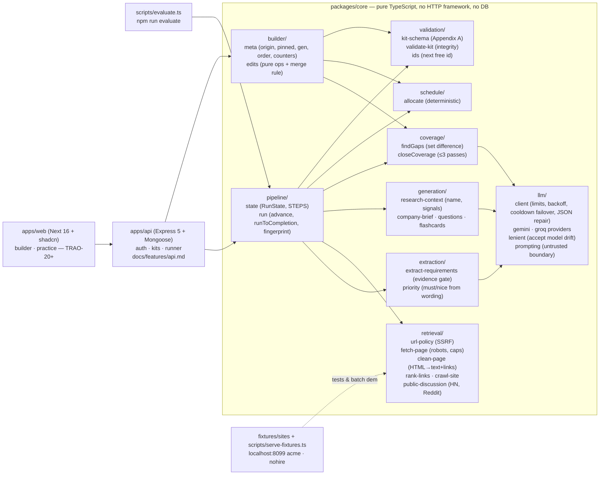
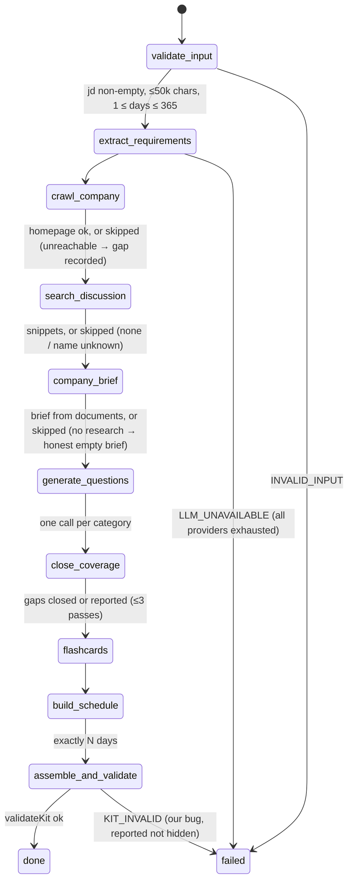
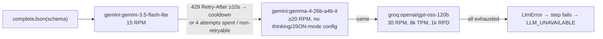

<!--
  The single current-state picture of this system. Graph form where possible, tables otherwise.
  Read this first after a session restart or context compaction; Notion holds task status, this
  holds how the system is shaped. Update it in the same change that changes the shape.
-->

# System graph

Status and task board: Notion project "Trao" (see `.claude/hooks/notion-session-start.sh`).
Decisions: `docs/decisions/`. What enforces what: `docs/ENFORCEMENT.md`. Per-feature flows: `docs/features/`.

## 1 · Modules

Dependency rule: arrows only point inward to `core`; `core` never imports from `apps/` or `scripts/`.
`apps/web` imports **types only** from core (core's runtime needs Node modules).
`testing/` inside core (fake LLM, fixture fetch, valid kit) is test-only and excluded from the build.

## 2 · The run: one state, ten steps

- `advance(state, deps)` runs exactly one step and returns new plain-JSON state (persistable, resumable).
- `runToCompletion()` loops it (CLI); the API `Runner` calls `advance()` one step at a time with an atomic per-kit lock and persists after each (`docs/features/api.md`).
- Research steps never fail the run; they record `gaps[]` and a `skipped` step status.
- `steps[]` carries `{name, status, ms, notes[]}` — the progress UI and the batch log read this.

## 3 · What each step consumes and produces

| Step                  | Reads                         | Writes to `artifacts`                                                                    | LLM calls           |
| --------------------- | ----------------------------- | ---------------------------------------------------------------------------------------- | ------------------- |
| validate_input        | input                         | —                                                                                        | 0                   |
| extract_requirements  | jd                            | `role` (title, seniority, requirements `r1…` with kind+priority, rejected[], thin, note) | 1 (+1 repair max)   |
| crawl_company         | company_url                   | `research` (homepage, aboutPage, hiringPage, gaps), `pagesUsed`                          | 0                   |
| search_discussion     | research.companyName          | `research.discussion` (≤8 snippets)                                                      | 0                   |
| company_brief         | research                      | `brief` (summary, what_they_do, sources), `hiringProcess`                                | 0 or 1              |
| generate_questions    | role, research, hiringProcess | `questions` `q1…`                                                                        | 1 per category (≤4) |
| close_coverage        | requirements, questions       | `questions` (+gap fillers), `coverage` {passes, uncovered, log}                          | 0–4                 |
| flashcards            | requirements                  | `flashcards` `f1…`                                                                       | 0 or 1              |
| build_schedule        | days, requirements, questions | `schedule`                                                                               | 0                   |
| assemble_and_validate | all                           | `kit` (Appendix A, validated)                                                            | 0                   |

Typical kit: 7–9 LLM calls. Five fixture cases: ~135 s on the current provider chain.

## 4 · Decisions the code makes that the model is not allowed to

| Fact                                | Decided by                                             | Where                                |
| ----------------------------------- | ------------------------------------------------------ | ------------------------------------ |
| Whether a requirement exists        | evidence must quote the JD (`indexOfLoose`)            | `extraction/extract-requirements.ts` |
| must vs nice                        | sentence wording → nearest heading → default must      | `extraction/priority.ts`             |
| Logistics are not requirements      | anchored regex on text/evidence                        | `extraction/extract-requirements.ts` |
| Every id (`r/q/f<n>`)               | assigned in code; prefix bound per list in schema      | `validation/ids.ts`, `kit-schema.ts` |
| Which question categories, how many | `planCategories` from kinds, seniority, hiring signals | `generation/questions.ts`            |
| Coverage gaps                       | set difference                                         | `coverage/coverage.ts`               |
| Day allocation, minutes             | arithmetic                                             | `schedule/allocate.ts`               |
| Company name                        | JD, else site title, never a hostname                  | `generation/research-context.ts`     |
| Whether to search discussion        | only with a known company name                         | `pipeline/run.ts`                    |

## 5 · LLM provider chain (measured 2026-09-11)

Each provider has its own RPM/TPM bucket (`.env`). Output parsed via `extractJson` → lenient preprocess
→ zod; one repair round-trip, then error. Untrusted text always inside `wrapUntrusted()` blocks.

## 6 · Where a fact lives

| Fact                             | Lives in                                        | Not in                                      |
| -------------------------------- | ----------------------------------------------- | ------------------------------------------- |
| Appendix A shape                 | `validation/kit-schema.ts`                      | README (describes it), prompts (ask for it) |
| Error codes for Appendix B       | `pipeline/state.ts` `RunErrorCode`              | CLI (passes through)                        |
| Free-tier model limits           | `.env.example` defaults, README table, ADR 0003 | code constants (only fallbacks)             |
| Task status / what is next       | Notion board                                    | repo                                        |
| Why a decision was taken         | `docs/decisions/`                               | Notion (one-liners linking here)            |
| Which rule is held by which test | `docs/ENFORCEMENT.md`                           | —                                           |

## 7 · Open questions

- **Stale `dist` trap** — `@trao/core` exports `dist/` for `import`; vitest in `apps/api` aliases the package to `src/`
  and `tsx --conditions=source` does the same in dev, otherwise a stale build shadows the source (two `LlmError`
  classes). Production builds core first (`npm run build` at the root).
- **Edit / pinned state model (TRAO-19)** — per-item `origin` + `pinned` + section `gen`, kept _alongside_ the
  Appendix A kit (not inside it) so batch output stays pure. To be locked when the API lands.
- **Practice ordering (TRAO-22)** — confidence-weighted sort with recency tiebreak; proper SRS intervals rejected
  for a ≤60-day horizon.
- **Reddit** returns 403 to our bot user-agent; HN works. Leave honest, document.
- **Gemini flash-lite RPD** not yet observed (only RPM=15 seen). If a daily cap bites in grading, Gemma and Groq carry the run.
- **DNS rebinding** (URL policy resolves, fetch resolves again) — known limitation, not in this timebox.
